# AutoAnnot: An automatic annotation toolkit

`AutoAnnot` is a minimalist toolkit for automatically annotating speech data from raw WAV files. This toolkit is 
loosely based on the pipeline described in the paper presented at [ASRU conference 2023](http://www.asru2023.org/) 
(see below for the citation). However, there are some differences between the pipeline presented there and `AutoAnnot`

Firstly, `AutoAnnot` is optimized for simplicity and ease of use rather than performance. This means that it is highly
recommended that the final annotations be manually corrected (see below).

Secondly, `AutoAnnot` was created primarily as a toolkit for annotating speech for the purpose of scientific study. For
this reason, the final output can be further used by other scientific applications such as 
[Praat](https://www.fon.hum.uva.nl/praat/) and [ELAN](https://archive.mpi.nl/tla/elan)

```mermaid
graph LR
    
    subgraph diarize
        
        %% Combined
        sppas("SPPAS"):::backend --> combined("combined"):::backend;
        pyannote("pyannote"):::backend --> combined;
        
        sppas --> diarization["diarization"]:::output;
        pyannote --> diarization;
        combined --> diarization;
    end
    
    subgraph transcribe 
        
        %% Transcription
        diarization --> transcribe_whisper("transcribe (Whisper)"):::backend;
        diarization --> transcribe_wav2vec2("transcribe (Wav2Vec2)"):::backend;
        transcribe_whisper --> clean("clean"):::process;
        transcribe_wav2vec2 --> clean;
        clean --> transcription["transcription"]:::output;
        
        transcription --> correct(("correct")):::manual;
        correct --> manual_transcription["manual transcription"]:::output;
    end
    
    subgraph forced align 
        
        transcription --> align("align");
        manual_transcription --> align:::process;
        
        align --> aligned["aligned annotation"]:::output;
        
        aligned --> correct_align(("correct")):::manual;
        correct_align --> corrected["corrected annotation"]:::output
    end
    
    classDef process fill:#048, stroke:#000, stroke-width:3; 
    classDef backend fill:#048, stroke:#000, stroke-dasharray: 5 5, stroke-width:3; 
    classDef output fill:#920, stroke:#000, stroke-width:3;
    classDef manual fill:#083, stroke:#000, stroke-width:3;
```




## Supported Languages

Currently **only French** is supported in full. But the toolkit can still be used for other languages up to certain
stages in the pipeline

### Diarization
The diarization process is fully **language independent** thus can be used with any languages

### Transcription
Transcription relies on Transformer based models provided by [Hugging Face](https://huggingface.co/). Therefore, which
language can be transcribed depends on the model chosen as the backend

#### Whisper-based models

##### Distilled French Whisper (v3 large)
[Distilled version of **French** Whisper](https://huggingface.co/bofenghuang/whisper-large-v3-french-distil-dec2), 
only 756M parameters

model-name: `bofenghuang/whisper-large-v3-french-distil-dec2"`

#### Wav2Vec2-based models

##### Massively Multilingual Speech (MMS)

[MMS](https://huggingface.co/facebook/mms-1b-all) supports 1000+ languages

model name: `facebook/mms-1b-all`

### Forced Alignment
Currently this step uses [SPPAS](https://sppas.org/) wrapper for 
[Julius](https://www.sp.nitech.ac.jp/~ri/julius-dev/doxygen/julius/4.0/en/index.html) and for the time being
**only French language** is supported


## Support

The toolkit was tested on:

* MacOS Sonoma 14.4.1

## Citations

Detailed evaluation of various techniques used in `AutoAnnot` can be found here:

```bibtex
@inproceedings{yamasaki2023transcribing,
  title={Transcribing And Aligning Conversational Speech: A Hybrid Pipeline Applied To French Conversations},
  author={Yamasaki, Hiroyoshi and Louradour, J{\'e}r{\^o}me and Hunter, Julie and Prevot, Laurent},
  booktitle={2023 IEEE Automatic Speech Recognition and Understanding Workshop (ASRU)},
  pages={1--6},
  year={2023},
  organization={IEEE}
}
```
